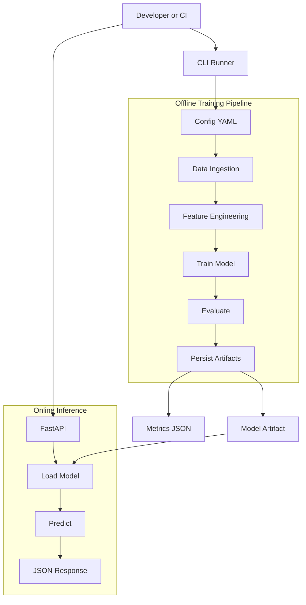

# Architecture — ML Production Pipeline

```mermaid
flowchart TD
  DEV[Developer or CI] --> CLI[CLI Runner]

  subgraph Pipeline[Offline Training Pipeline]
    CFG[Config YAML] --> ING[Data Ingestion]
    ING --> FEAT[Feature Engineering]
    FEAT --> TRAIN[Train Model]
    TRAIN --> EVAL[Evaluate]
    EVAL --> ART[Persist Artifacts]
  end

  CLI --> CFG
  ART --> MODEL[Model Artifact]
  ART --> METRICS[Metrics JSON]

  subgraph Serving[Online Inference]
    API[FastAPI] --> LOAD[Load Model]
    LOAD --> PRED[Predict]
    PRED --> RESP[JSON Response]
  end

  MODEL --> LOAD
  DEV --> API
```
